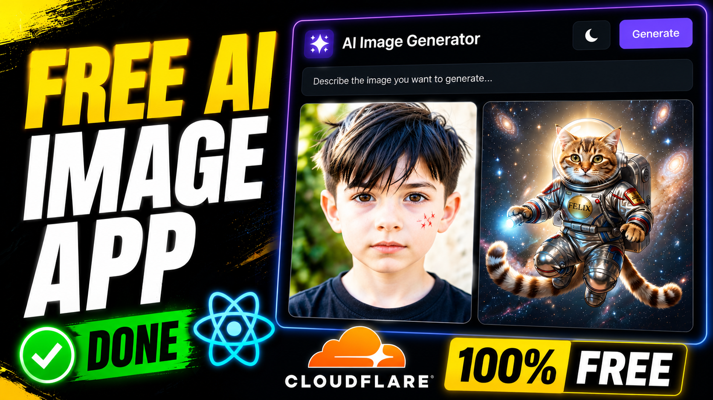

<!-- [](https://youtube.com) -->

<a href="https://youtu.be/G5XC3Ltpf_8" target="_blank">
  
</a>


# AI Image Generator Web App

A full-stack AI Image Generation web application built with **React**, **Node.js**, **Express**, and **Cloudflare Workers AI (FLUX-2-Klein-9B)**. Users can generate high-quality AI images from natural language prompts and download the generated results.

> 📺 This repository is the official source code for my YouTube tutorial.

## Features

- AI image generation from text prompts
- Cloudflare Workers AI integration
- React Hook Form validation
- Responsive modern UI with Tailwind CSS
- Loading state and error handling
- One-click image download
- Express REST API backend
- Environment variable support

## Tech Stack

### Frontend
- React
- Tailwind CSS
- React Hook Form

### Backend
- Node.js
- Express.js
- Cloudflare Workers AI
- CORS
- dotenv

## Project Structure

```text
ai-image-generator/
├── src/
│   ├── App.jsx
│   └── package.json
├── server/
│   ├── index.js
│   ├── .env
│   └── package.json
└── README.md
```

## Environment Variables

Create a `.env` file inside the `server` directory.

```env
ACCOUNT_ID=your_cloudflare_account_id
API_TOKEN=your_cloudflare_api_token
```

## Installation

### Clone Repository

```bash
git clone https://github.com/asadullah-shehbaz/Free-AI-Image-Generator-Web-App.git
cd ai-image-generator
```

### Backend

```bash
cd server
npm install
npm run dev
```

### Frontend

```bash
cd client
npm install
npm run dev
```

## API

### Generate Image

**POST**

```
/generate-image
```

Request

```json
{
  "prompt": "A futuristic city at sunset"
}
```

Response

```json
{
  "image": "base64_encoded_image"
}
```

## Demo

Generate an image by entering a prompt, wait for the AI to create it, then download the generated image.

## Learning Outcomes

- Building a full-stack AI application
- Working with REST APIs
- Integrating Cloudflare Workers AI
- Managing environment variables
- Form validation with React Hook Form
- Handling loading and error states
- Returning Base64 images from an API

## YouTube Tutorial

Watch the complete step-by-step tutorial on my YouTube channel. 

**Channel:** [Asadullah AI](https://www.youtube.com/@aiasadullah)

## License

This project is licensed under the MIT License.
